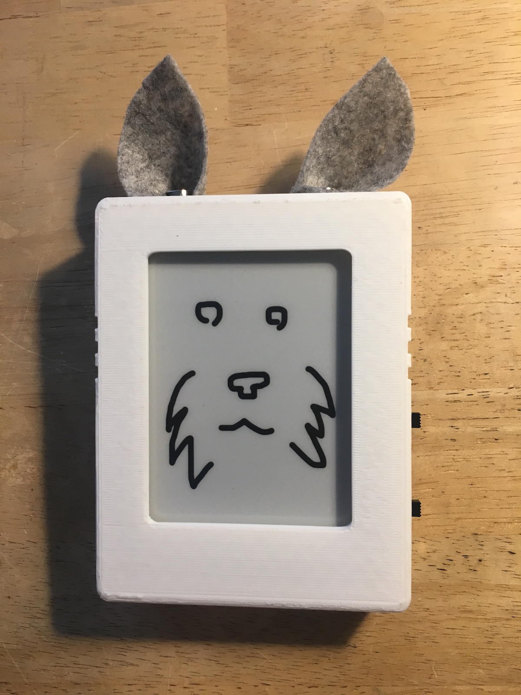

# Pet Bot

IoT connected pet bot connecting an E-ink display to an ESP8266 microcontroller connected through to the AWS IoT service.

Device Shadows are used in AWS IoT to model the ESP8266 when not connected to the network.
When connected, this allows the use of MQTT to transmit message from the server to the device and vice-versa.

Events (created through IFTTT) push data through an API Gateway to an AWS Lambda function to update the Device Shadow (Again through MQTT).

This repository contains:

* [3d models](3d) which were 3d printed in white
* [API Gateway/AWS Lambda functions](aws-lambda) used in the "serverless" backend
* [C++ code](src) used to program the microcontroller
* [Wiring schematics](schematic)
* [SD Card images](sdcard)
* [Network Diagram](network) for the whole system
